# 🗳️ Camp9 Final Project — D'accord

A full-stack web application that allows users to **create, manage, and vote on polls** in real time. Built as the final project of the [Devhaus Leipzig]Full Stack Bootcamp.

---

## 📸 Screenshots

### Login Page
<!-- Add a screenshot of the landing / home page here -->


### Landing Page
<!-- Add a screenshot of the landing / home page here -->
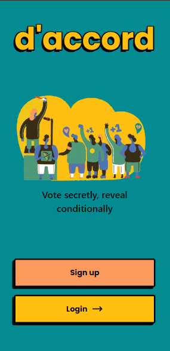

### Create a Poll
<!-- Add a screenshot of the poll creation form here -->
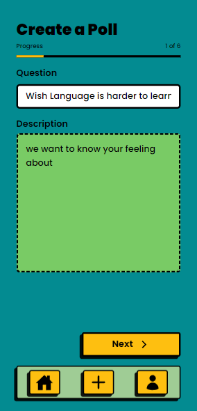
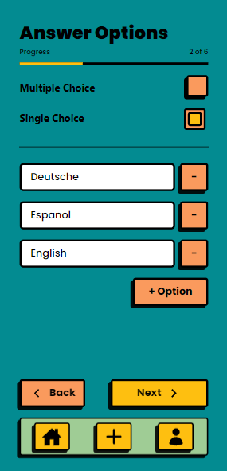
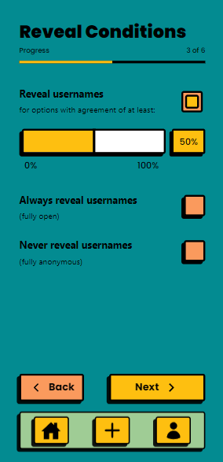
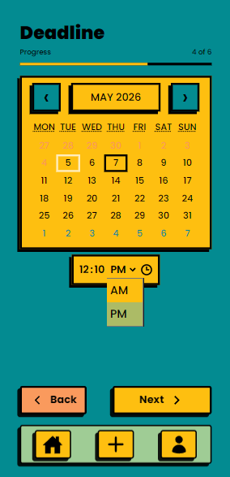
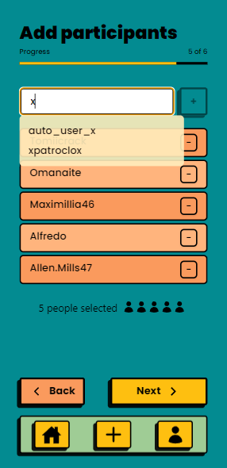
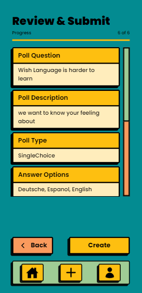

### Voting View
<!-- Add a screenshot of the voting interface here -->
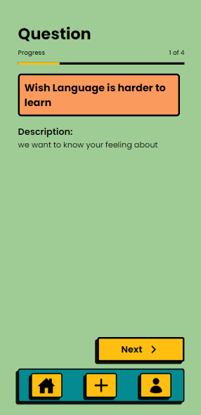
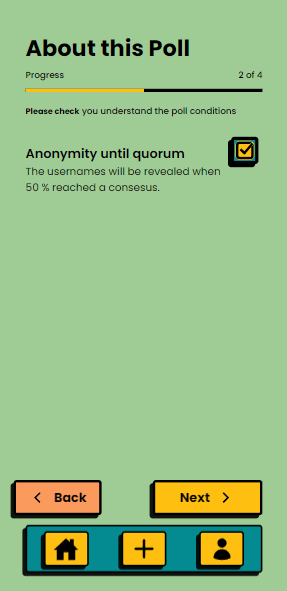
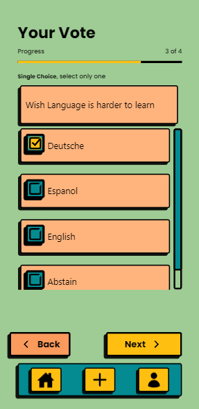
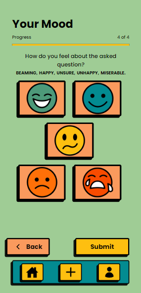
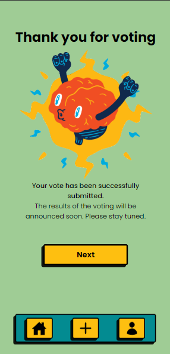

### Results Page
<!-- Add a screenshot of the results visualization here -->
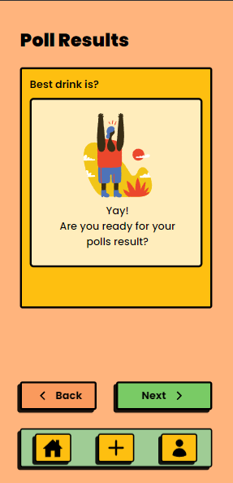
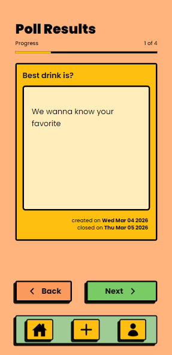
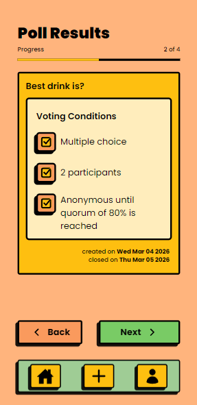
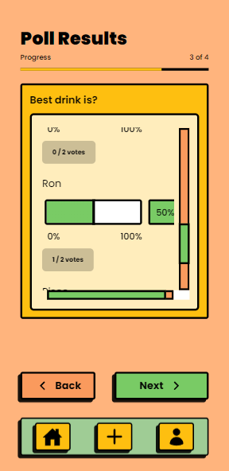
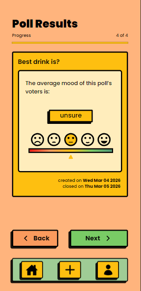

---

## ✨ Features

Users can:

- **Register and log in** securely with email and password
- **Create polls** with custom questions, options, date, and time settings
- **Vote** on active polls shared by other users
- **View results** with a visual breakdown of votes per option
- **Manage their own polls** — see pending, active, and closed polls from a personal dashboard
- **Browse poll details** before casting a vote

Access to all core features is protected — authentication is required.

---

## 🛠️ Tech Stack

| Layer | Technology |
|---|---|
| Framework | [Next.js 13](https://nextjs.org/) (App Router) |
| Language | TypeScript |
| Styling | Tailwind CSS |
| Database | PostgreSQL |
| ORM | Prisma |
| Authentication | NextAuth.js v4 + bcrypt |
| Server state | React Query (TanStack Query) |
| Client state | Zustand |
| Forms & Validation | React Hook Form + Zod |
| UI Components | Headless UI, React Icons |
| Notifications | React Toastify |
| Date/Time Pickers | react-calendar, react-time-picker |
| Component Docs | Storybook |
| E2E Testing | Cypress |
| Deployment | Vercel |

---

## 🗂️ Project Structure

```
├── app/              # Next.js 13 App Router — pages and layouts
├── components/       # Reusable UI components
├── services/         # API call functions (axios + React Query)
├── libs/             # Shared utilities and singleton instances (e.g. PrismaClient)
├── types/            # Global TypeScript types and interfaces
├── utils/            # Helper functions
├── stories/          # Storybook component stories
├── prisma/           # Database schema and seed data
└── cypress/          # End-to-end tests
```

---

## 🔐 Authentication & Route Protection

Authentication is handled by **NextAuth.js** with a credentials provider (email + password, hashed with bcrypt). The following routes require the user to be logged in:

- `/new` — create a new poll
- `/mypolls` — personal poll dashboard
- `/pending` — polls awaiting action
- `/voting` — active voting session
- `/results` — view voting results
- `/details/:id` — poll detail view
- `/settings` — user settings

Unauthenticated users are automatically redirected to the login page via Next.js middleware.

---

## ⚙️ Getting Started

### Prerequisites

- Node.js 18+
- PostgreSQL database
- pnpm (recommended)

### Installation

```bash
# Clone the repository
git clone https://github.com/Omanaite/camp9-final-project.git
cd camp9-final-project

# Install dependencies
pnpm install

# Set up environment variables
cp .env.example .env
# Fill in your DATABASE_URL, NEXTAUTH_SECRET, NEXTAUTH_URL

# Run database migrations and seed
npx prisma migrate dev
npx prisma db seed

# Start the development server
pnpm dev
```

Open [http://localhost:3000](http://localhost:3000) in your browser.

---

## 🧪 Testing

```bash
# Run Cypress end-to-end tests
pnpm cypress open

# Run Storybook component explorer
pnpm storybook
```

---

## 🚀 Deployment

The app is deployed on [Vercel](https://vercel.com). Each push to `main` triggers an automatic deployment.

---

## 👥 Team

Built collaboratively by the students of **Devhaus Leipzig — Camp 9**.

- GitHub org: [devhausleipzigacademy](https://github.com/devhausleipzigacademy)
- Fork maintained by: [@Omanaite](https://github.com/Omanaite)
